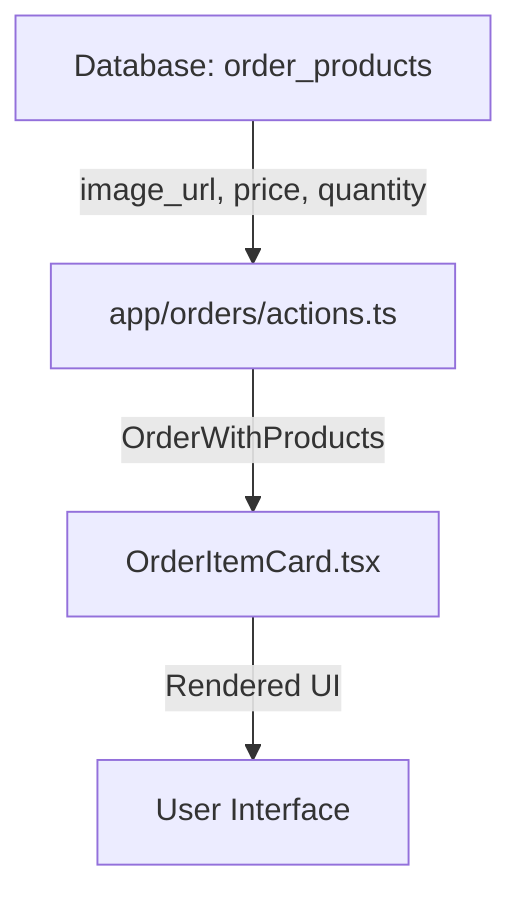

# Order Product Data Flow Documentation

## Overview
This document explains the data flow for order product information from the database through the application to the UI, including type requirements and validation rules.

## Data Flow Diagram



## Key Components

### 1. Database Schema (order_products table)
- `id`: UUID primary key
- `order_id`: Foreign key to orders table
- `product_id`: Sanity product ID
- `name`: Product name (string)
- `quantity`: Number of items (number)
- `price`: Unit price (number)
- `image_url`: URL to product image (string, nullable)

### 2. Type Definitions (app/orders/actions.ts)

```typescript
/**
 * OrderProduct interface - represents a product in an order
 * This must match the structure of the 'order_products' table in Supabase
 */
export interface OrderProduct {
  id: string; // UUID primary key from order_products table
  order_id: string; // Foreign key to orders table
  product_id: string; // Sanity product _id
  name: string;
  quantity: number; // Must be a valid number
  price: number; // Must be a valid number
  image_url: string | null; // Can be null if no image available
}
```

### 3. Data Fetching (app/orders/actions.ts)
The `getOrdersForUserAction` function:
1. Queries the `orders` table for user orders
2. For each order, queries the `order_products` table (corrected from previous bug)
3. Converts price and quantity to valid numbers with fallbacks:
   ```typescript
   price: typeof p.price === 'number' ? p.price : parseFloat(p.price) || 0,
   quantity: typeof p.quantity === 'number' ? p.quantity : parseInt(p.quantity) || 1,
   ```

### 4. UI Rendering (components/orders/OrderItemCard.tsx)
The component:
1. Validates product data and provides fallbacks:
   ```typescript
   name: product.name || 'Unknown Product',
   quantity: typeof product.quantity === 'number' ? product.quantity : 1,
   price: typeof product.price === 'number' ? product.price : 0,
   image_url: product.image_url || null
   ```
2. Handles image display with fallbacks:
   ```typescript
   src={product.image_url || `https://via.placeholder.com/80?text=${encodeURIComponent(product.name.slice(0, 10))}`}
   ```
3. Safely renders price and quantity with type checking:
   ```typescript
   Quantity: {typeof product.quantity === 'number' ? product.quantity : 'N/A'}
   Price: Ksh {typeof product.price === 'number' ? product.price.toFixed(2) : 'N/A'}
   ```

## Validation Rules

1. **Image URLs**:
   - Use actual product image if available
   - Fallback to placeholder with product name if no image
   - Never show broken image links

2. **Price and Quantity**:
   - Must be valid numbers
   - Default to 0 for price if invalid
   - Default to 1 for quantity if invalid
   - Display "N/A" if values are invalid

3. **Product Names**:
   - Default to "Unknown Product" if missing
   - Always display a name

## Error Handling

1. **Database Errors**:
   - Log errors when fetching order products
   - Continue with empty product list if error occurs

2. **Invalid Data**:
   - Provide fallback values for all critical fields
   - Never crash due to missing or invalid data
   - Log warnings for invalid data

3. **UI Fallbacks**:
   - Show "N/A" for invalid numeric values
   - Use placeholder images for missing images
   - Always display a product card even with minimal data

## Testing

Test cases verify:
- Valid product data is displayed correctly
- Invalid product data uses fallbacks
- Missing images show placeholders
- Invalid prices/quantities show "N/A"
- Empty product lists are handled gracefully

## Best Practices

1. Always validate data at each transformation step
2. Provide sensible fallbacks for all displayable fields
3. Log warnings for invalid data but don't crash
4. Keep type definitions in sync with database schema
5. Document data flow and transformation rules